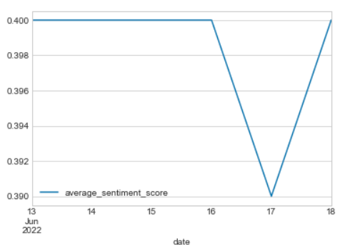

# NFT Sentiment Analysis

## Background 
This project aims to analyze sentiments for a particular NFT collection and determine its correlation with price action.
An attempt was made to train a machine learning model (RNN LSTM) based on twitter data classified using Vader Sentiment Intensity Analyzer.
However, due to the nature of the tweet data and most probably lack of data cleanup, the model was not identifying true positives correcly on the test data.

The project generated real time sentiment analysis from Tweets to determine the correlation with the closing price of the NFT Bored Ape Yatch Club collection over a one week period.

**The following approach was followed to generate sentiment analysis for an NFT collection and check its correlation to price action.**
- Get twitter data for 1 week from Twitter using Tweepy API based on a query for an NFT collection i.e Boared APE Yatch Club (BAYC)
- Sanitize the data to remove emojis, special characters, mentions, hyperlinks, etc
- User Vader Sentiment Intensity Analyser to get the sentiment of tweets 
- Classify the sentiment as positive/non-positive based on compound score >0.1
- Use this classified data for training the RNN LSTM model to classify future tweets
- The model did not do well, probably becuase of the type of data (short tweets with spelling mistakes and repeat texts), so it was not used further for analysis
- The price for the collection for 1 week was then fetched from OpenSea using API provided by OpenSea
- The sentiment and price for the 1 week period were then plotted to identify correlation between the two

## Installations
**This project uses the library tweepy to get the data from twitter**

pip install tweepy

## Usage Examples 
***BAYC (Boared APE Yatch Club) NFT Sample***

***World Cloud to indicate most common words in Tweets related to BAYC***

***Classification Report of RNN LTSM model***

***The ROC curve shows the trade-off between sensitivity (or TPR) and specificity (1 – FPR)***

***Sentiment change for BAYC over 1 week period***

***Price change for BAYC over 1 week period***

***Correlation between Sentiment and Price of BAYC over 1 week period***

***HeatMap to indicate correlation between Sentiment and Price for a 1 week period***

## Findings
* The correlation we found was not clear. The hypothesis was that there would be a positive sentiment as prices went up and vice versa.
* The data was insufficient to determine any correlation.
* There are many different ways to approach this task, but they require time to test and validate the results and see what works and what doesn’t, requiring more than two weeks. 
* The full process required to get the API keys, see all the options available, pull the data, run the model, and understand the pros and cons of different types of tweets was fullfilled. 
* The approach of using hashtags (#NFT, #BAYC) can be one of the purest ways to gather people’s sentiment, but there is significant effort required to clean up the data, whereas specialized publications with language that is more polished could have been used, similar to what was used in class, but with a potentially distorted view of client sentiment in real time, which in the end is what we were trying to understand.
* This does not mean that the RNN LSTM model was not good, but it was probably not the best approach for this project considering the time and resources available, however with futher exploration the model could be a good choice.

## Recommendations
**In order to continue improving this tool, we could explore other methods, for example:**
* Use ngrams to read sentiment via sequencing of words.
* Clean up and classify tweets manually, the challenge with this is that its could be very time consuming to go through thousands of tweets, and we would need to be  cautious to make sure our personal biases do not affect the results of the classification exercise.
* Take NFT pricing to another level and use Machine Learning to try to predict future valuations of NFT collections, in combination with Sentiment analysis to reach a more reliable future valuation. Machine learning models could be particularly helpful here considering that many NFT collections don’t have a lot price history.
* Incorporate additional data sources to our analysis to make it more accurate and complete, for example adding Discord, Articles, or curating a list of hashtags, NFT publications , and key influencers to try to present a balanced view of NFT sentiment.
* Use a longer period of time, months or years. 
* Once a solid model is created that is more accurate, replicate it to other collections beyond BAYC (I.e.Doodles, Mutant Ape Yatch club, Crypto punks , etc)

## Contributors
Chantal Garnett

Sameer Lakhe

Emiliano Mendez

Marcus Policicchio 

